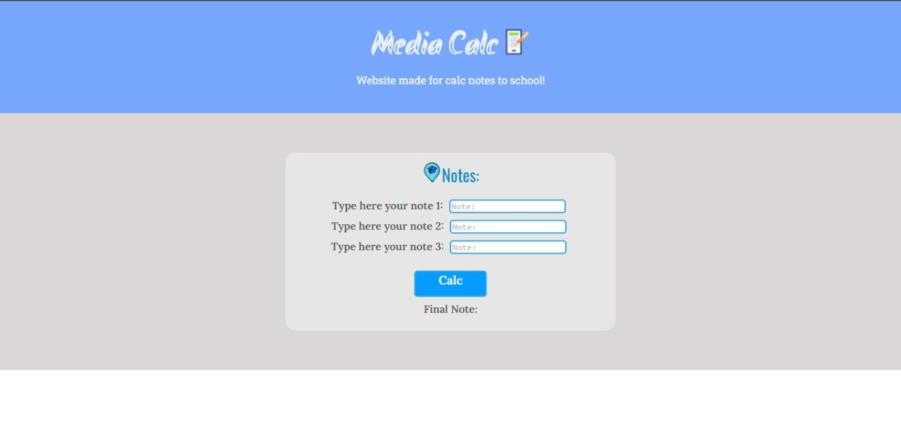

# AverageNotes 
Website made by Joao, for a calc average for a notes...

## Description 

The Average Notes is a program made by Joao, in your second version, made in #imersaoDev Alura!
It was made in pure CSS, without framework or library codes... I prefer make with this, because want practice my soft skills in code.

### Technologies 

- JS  
"I used a simple and soft functions!"

- CSS 
"I preferred separate the files for each part of the site, separating into folders for each one"

- HTML5 

- File icons in (https://www.flaticon.com/)

